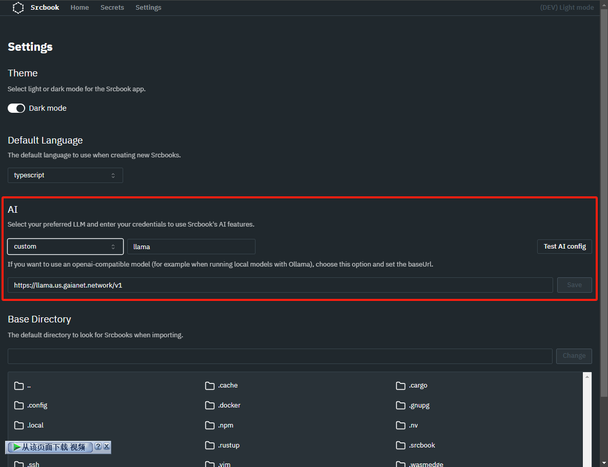
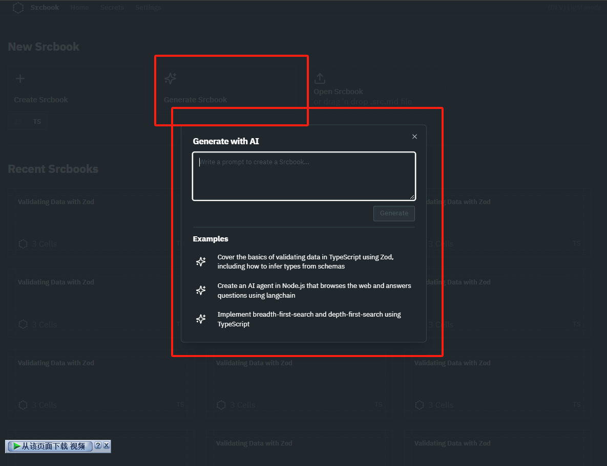

# Adapting Srcbook for Gaia

I have adapted the srcbook to work with Gaia by making two key adjustments:
1. Modified the prompt.
2. Added some logs to help with debugging.

## Getting Started
The project setup is simple. After running `pnpm install`, you can start the project by running `pnpm dev`. Once started, the project will be available on `localhost:5173`.

After opening the project, first click on **Settings** to configure the models, then click on **Generate Srcbook** to start the process.



## Current Issues
In the current version, prompt debugging is not yet fully optimized. The main issue is that the code blocks lack filenames, which prevents them from being segmented and displayed properly.

For example, Generate Srcbook's prompt is in [there](packages/api/prompts/srcbook-generator.txt).

###### `packages.json`
```json
{
  "name": "srcbook-gaia",
  "version": "1.0.0",
  "scripts": {
    "dev": "vite",
    "build": "vite build",
    "serve": "vite preview"
  },
  "dependencies": {
    "vite": "^3.0.0",
    "react": "^18.0.0",
    "gaia-node-sdk": "^1.0.0"
  },
  "devDependencies": {
    "pnpm": "^7.0.0"
  }
}
```

